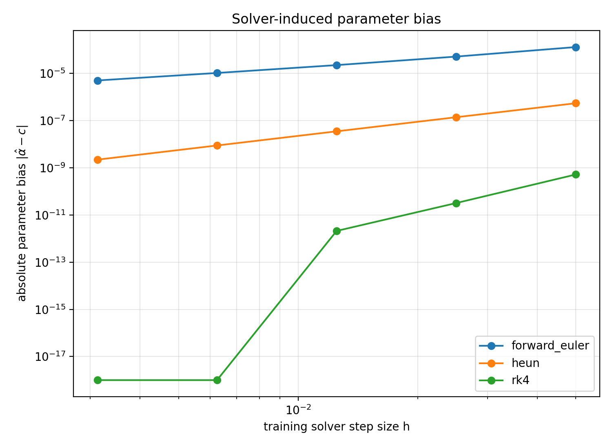
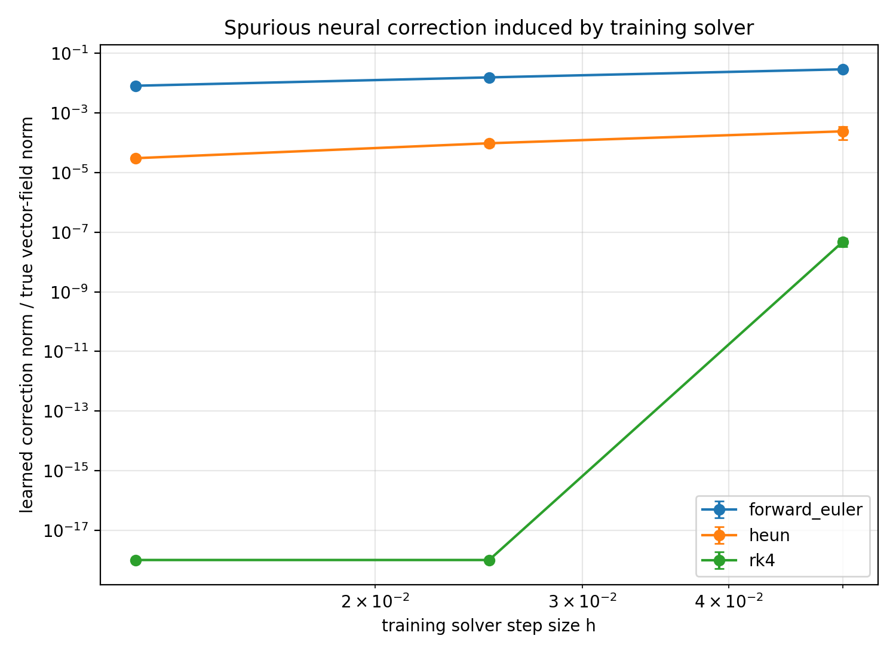
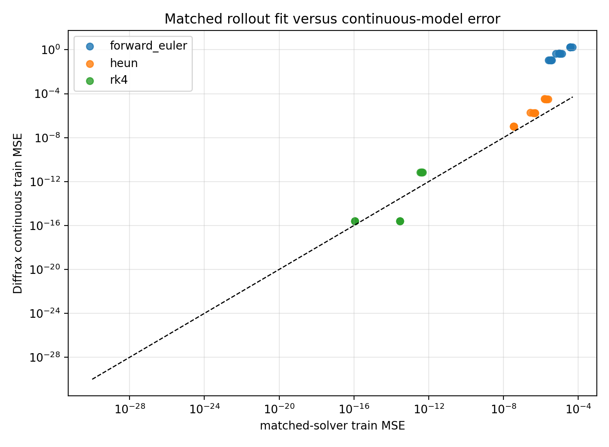
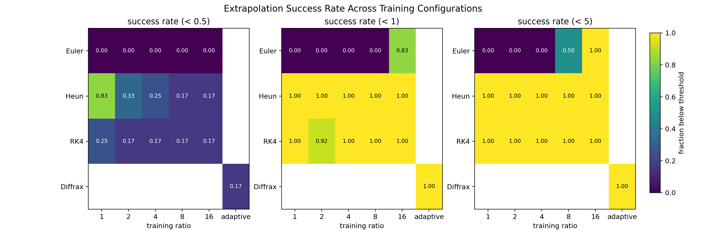
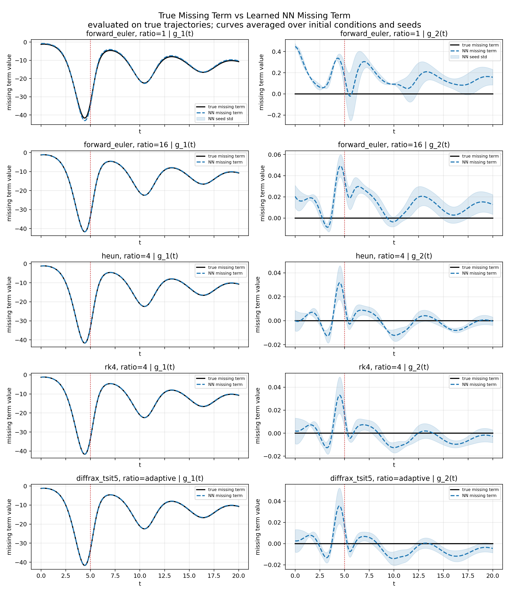

# CSC494 Research Project
## Error Propagation in Numerical Integration for Residual Neural ODE Parameter Estimation

### Student
Lu Wang, Guo Youyou

### Supervisor
Prof. Jonathan Calver

---

# Project Overview

This project investigates how numerical integration error propagates through the training process of Residual Neural ODE models and affects:

- gradient and sensitivity calculations,
- learned parameter estimates,
- trajectory prediction accuracy,
- recovery of underlying physical dynamics.

The project focuses on understanding how solver choice and discretization error influence scientific machine learning systems.

---

# Key Findings

1. **A training solver can bias physical parameter recovery even with noiseless
   data and successful optimization.** In a controlled one-parameter
   experiment, the bias decreases with step size at approximately the nominal
   solver order.

2. **A flexible neural residual can learn numerical error instead of missing
   physics.** When the physics model is already exact and the true residual is
   zero, low-order training solvers still induce a nonzero neural correction.

3. **A low matched-solver training loss does not guarantee an accurate
   continuous-time model.** Re-evaluating the learned vector field with a
   high-accuracy adaptive solver can reveal errors hidden by compensation
   between the neural residual and the training solver.

4. **Solver choice has a large practical effect on extrapolation.** Across the
   192-run carrying-capacity sweep, the fraction of runs with extrapolation
   MSE below 1 was 16.7% for Forward Euler, 100% for Heun, 98.3% for RK4, and
   100% for adaptive Tsit5. These are descriptive results across the evaluated
   configurations, not a solver-only causal estimate.

---

# Featured Experiments

## 1. Solver-Induced Parameter Bias

This controlled baseline isolates numerical parameter bias by fitting one known
Lotka--Volterra parameter while changing only the training solver and step
size. Forward Euler, Heun, and RK4 approach first-, second-, and fourth-order
parameter-bias decay, respectively, before numerical precision limits the
measurement.



- Experiment:
  [`one_parameter_solver_bias.py`](code/error_propagation/one_parameter_solver_bias.py)
- Results:
  [`one_parameter_solver_bias_results/`](code/error_propagation/one_parameter_solver_bias_results/)

## 2. Exact Physics, Zero True Residual

This is the cleanest mechanism test in the project. The mechanistic vector
field supplied to the model is already exact, so the correct neural residual is
identically zero. A nonzero learned correction therefore measures spurious
dynamics introduced during training rather than genuinely missing physics.

The learned correction decays at empirical order 0.917 for Forward Euler and
1.497 for Heun over the tested step sizes. RK4 reaches the numerical or
optimization floor, so a reliable empirical correction order cannot be fitted.



The second diagnostic compares the error evaluated with the same discrete
solver used during training against the error obtained by integrating the
learned continuous vector field with high-accuracy Diffrax. Points far above
the diagonal indicate solver-error compensation: the discrete rollout fits the
data while the underlying continuous model is inaccurate.



- Experiment:
  [`exact_physics_zero_residual_sweep.py`](code/error_propagation/exact_physics_zero_residual_sweep.py)
- Results:
  [`exact_physics_zero_residual_results/`](code/error_propagation/exact_physics_zero_residual_results/)

## 3. Full Residual Neural ODE Solver Sweep

The main carrying-capacity experiment scales the mechanism tests to a complete
Residual Neural ODE. It crosses:

- Forward Euler, Heun, RK4, and adaptive Tsit5;
- five fixed-step training ratios;
- four residual-regularization profiles;
- three initialization seeds.

The full grid contains 192 runs. The figure below shows that coarse Forward
Euler training is much less reliable for long-horizon extrapolation than the
higher-order solvers under the evaluated configurations.



Across all 192 runs, model vector-field relative error has Pearson correlation
0.990 with extrapolation MSE, whereas physical-parameter relative error has
correlation 0.149. This suggests that recovery of the complete vector field is
a more useful diagnostic of long-horizon behavior in this sweep than parameter
recovery alone. Because these correlations pool different solvers,
regularization profiles, and step sizes, they should not be interpreted as
causal effects.

- Experiment:
  [`carrying_big_factor_sweep.py`](code/residual_neural_ode/lotka-volterra/carrying_big_factor_sweep.py)
- Results:
  [`carrying_big_factor_sweep_results/`](code/residual_neural_ode/lotka-volterra/carrying_big_factor_sweep_results/)
- Analysis:
  [`carrying_big_factor_sweep_visualizations/`](code/residual_neural_ode/lotka-volterra/carrying_big_factor_sweep_visualizations/)

The existing 192-run directory predates the current run-manifest system.
Report-quality reproductions should use a fresh output directory and retain the
generated provenance manifests; see
[`REPRODUCIBILITY.md`](REPRODUCIBILITY.md).

## Additional Missing-Term Diagnostic

The true incomplete-physics experiment omits the carrying-capacity term only
from the prey equation:

```math
g_{\mathrm{true}}(x,y)
=
\begin{bmatrix}
-c x^2 \\
0
\end{bmatrix}.
```

The left column below checks recovery of the nonzero missing term. The right
column checks whether the network invents a spurious correction in the
predator equation, whose true missing term is zero. The red vertical line marks
the end of the training interval.



---

# Research Questions

The project aims to study:

1. How numerical integration error affects gradient and sensitivity calculations during Neural ODE training.

2. How numerical errors influence learned parameter estimates.

3. Whether improved trajectory accuracy necessarily corresponds to improved recovery of underlying physical parameters.

4. How these effects vary across numerical integration methods and discretization step sizes.

---

# Model Formulation

The project studies Residual Neural ODE models of the form

```math
\frac{dx}{dt}
=
f_{\mathrm{phys}}(x,\phi)
+
r_\theta(x)
```

where

- $f_{\mathrm{phys}}(x,\phi)$ represents known mechanistic dynamics,

- $\phi$ denotes physical parameters,

- $r_\theta(x)$ is a neural residual correction term parameterized by $\theta$.

Experiments will compare:

- classical parameter estimation methods,
- pure Neural ODE models,
- Residual Neural ODE models.

---

# Benchmark Systems

The experiments use low-dimensional dynamical systems, including:

- damped nonlinear oscillators,
- Lotka–Volterra predator–prey systems.

Synthetic trajectory data are generated using high-accuracy numerical solvers
to provide:

- reference trajectories,
- ground truth parameters,
- sensitivity baselines.

---

# Numerical Methods

The project compares multiple numerical integration schemes, including:

- Forward Euler,
- Runge–Kutta methods,
- adaptive solvers,
- multistep methods.

Experiments will vary:

- discretization step size $\Delta t$,
- solver order,
- observational noise level.

---

# Evaluation Metrics

Performance will be evaluated using:

## Trajectory Prediction Error

Given predicted trajectory $\hat{x}(t)$ and reference trajectory $x(t)$,

```math
\mathrm{MSE}
=
\frac{1}{N}
\sum_{i=1}^N
\|x_i - \hat{x}_i\|^2
```

## Parameter Estimation Error

For estimated parameters $\hat{\theta}$ and ground-truth parameters
$\theta^\ast$,

```math
\mathrm{Relative\ Parameter\ Error}
=
\frac{
\|\hat{\theta}-\theta^\ast\|
}{
\|\theta^\ast\|
}
```

## Vector-Field Relative Error

The learned and true vector fields are compared directly on a uniform
state-space evaluation grid $\mathcal{S}$:

```math
E_{\mathrm{VF,rel}}
=
\frac{
\left(\sum_{s\in\mathcal{S}}
\|f_{\mathrm{model}}(s)-f_{\mathrm{true}}(s)\|_2^2\right)^{1/2}
}{
\left(\sum_{s\in\mathcal{S}}
\|f_{\mathrm{true}}(s)\|_2^2\right)^{1/2}
}.
```

This global relative error measures recovery of the continuous dynamics
without integrating a trajectory. It is distinct from trajectory prediction
error and gives greater weight to regions where the true vector field has
larger magnitude.

## Gradient Error

The project will compare gradients computed using different numerical solvers against high-accuracy reference gradients:

```math
E_{\mathrm{grad}}
=
\left\|
\nabla_\theta L_{\mathrm{solver}}
-
\nabla_\theta L_{\mathrm{ref}}
\right\|_2
```

## Sensitivity to Numerical Discretization

The project will study how learned dynamics vary under different choices of:

- step size,
- solver order,
- adaptive tolerances.

---

# Implementation

The project is implemented using:

- JAX
- Diffrax

Residual dynamics are represented using small multilayer perceptrons (MLPs).

Classical parameter-estimation methods and pure Neural ODE models are used as
baselines for the Residual Neural ODE experiments.

---

# Repository Structure

- `code/library_exploration/`: early JAX and parameter-recovery prototypes.
- `code/error_propagation/`: solver-error baselines, train/predict solver sweeps,
  no-noise controls, and seed-sensitivity analysis.
- `code/residual_neural_ode/`: logistic, oscillator, and Lotka--Volterra
  Residual Neural ODE experiments.
- `code/residual_neural_ode/lotka-volterra/`: carrying-capacity solver,
  regularization, and training-interval sweeps.
- `meetings/`: weekly research presentations.
- `papers/`: project references managed with Git LFS.

See [`REPRODUCIBILITY.md`](REPRODUCIBILITY.md) for the pinned environment,
canonical experiment commands, smoke tests, and provenance requirements.

# Current Status

- [x] Initial proposal
- [x] Baseline parameter estimation
- [x] Pure Neural ODE implementation
- [x] Residual Neural ODE implementation
- [x] Numerical error propagation experiments
- [x] Solver/step-size/seed sweeps
- [x] Carrying-capacity solver and regularization sweeps
- [x] Carrying-capacity training-interval sweep
- [ ] Final analysis and report

---

# References

1. Chen, T. Q., Rubanova, Y., Bettencourt, J., & Duvenaud, D.  
   *Neural Ordinary Differential Equations*, NeurIPS 2018.

2. Calver, J., & Enright, W.  
   *Numerical Methods for Computing Sensitivities for ODEs and DDEs*, Numerical Algorithms, 2017.
